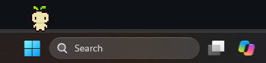

# Copilot Buddy



Copilot Buddy turns GitHub Copilot CLI into a small Windows desktop companion.
It wanders along the Windows 11 taskbar, watches the Copilot sessions it
launches, and gets your attention when a session needs approval, has a
question, finishes work, or is running heavy on context.

Buddy is more than a notification mascot. It can focus active sessions, open
new ones, hand work to a fresh session, store sessions as presents, gather
managed terminal windows, and provide lightweight ambient feedback without
taking control away from the terminal.

> **Platform status:** Copilot Buddy currently supports Windows 11 on x64 and
> ARM64.
> Release executables are unsigned, and WinGet installation is planned but is
> not available yet.

## Quick Start

### Option 1: Download the Windows executable

1. Install [GitHub Copilot CLI](https://github.com/github/copilot-cli) and
   complete its sign-in flow:

   ```powershell
   winget install --id GitHub.Copilot --exact
   ```

2. Download the executable for your Windows system from the
   [latest GitHub Release](https://github.com/aufty/copilot-buddy/releases/latest):
   `CopilotBuddy-win-arm64.exe` for ARM64 devices or
   `CopilotBuddy-win-x64.exe` for x64 devices.
3. Run the downloaded executable.

The release is self-contained, so the .NET SDK and runtime are not required.
It also includes the validated Copilot runtime used by Buddy; the separate
GitHub Copilot CLI installation provides the signed-in command and terminal
experience.

Copilot Buddy is not currently code-signed. Windows Defender SmartScreen may
show **Windows protected your PC** the first time it runs. If you downloaded
the executable from this repository's GitHub Releases page, select
**More info**, verify the publisher is listed as unknown, and choose
**Run anyway**. Some organization policies block unsigned applications
entirely.

You can optionally verify the download against its matching `.sha256` file,
which is attached to the same release.

### Option 2: Build and run locally

Prerequisites:

- Windows 11
- [.NET 10 SDK](https://dotnet.microsoft.com/download/dotnet/10.0), version
  `10.0.401` or a later .NET 10 feature band
- GitHub Copilot CLI, installed and signed in
- Git

From a PowerShell terminal:

```powershell
git clone https://github.com/aufty/copilot-buddy.git
Set-Location copilot-buddy
dotnet restore .\CopilotBuddy.slnx
dotnet run --project .\src\CopilotBuddy.Composition
```

To build and test before running:

```powershell
dotnet restore .\CopilotBuddy.slnx
dotnet build .\CopilotBuddy.slnx --no-restore
dotnet test .\tests\CopilotBuddy.Core.Tests\CopilotBuddy.Core.Tests.csproj --no-restore
dotnet run --project .\src\CopilotBuddy.Composition --no-build
```

The Debug executable is written to:

```text
src\CopilotBuddy.Composition\bin\Debug\net10.0-windows10.0.22000.0\CopilotBuddy.Composition.exe
```

Only one Copilot Buddy UI can run in a Windows user session. Right-click Buddy
or its notification-area icon and select **Exit** before launching another
build.

## What Copilot Buddy Does

- **Surfaces Copilot activity:** permission requests, questions, plan reviews,
  errors, and completed work appear as speech bubbles without stealing focus.
- **Manages session attention:** click Buddy or a bubble to focus the oldest
  managed session that needs you.
- **Launches and resumes work:** summon a new Copilot CLI session, reopen a
  stored session, or continue from a generated handoff.
- **Helps with long sessions:** context-heavy sessions produce a visible
  warning and can be focused before they become difficult to manage.
- **Organizes windows:** gather Buddy-managed terminal windows into a tiled
  layout.
- **Adds a playful desktop presence:** drag, throw, feed, water, entertain, or
  seat Buddy while normal Copilot work continues.
- **Stays out of the approval loop:** authentication, trust, tool approvals,
  questions, prompts, and plan decisions remain in the terminal.

Copilot Buddy observes only Copilot CLI windows that it launches or resumes.
It does not attach to arbitrary existing terminals.

## Everyday Use

Open the Buddy Menu by pressing **Alt+Space** or by right-clicking Buddy, its
bubble, or its notification-area icon.

| Action | Default shortcut | What it does |
|---|---:|---|
| Summon | `Alt+Enter` | Focuses the oldest pending session, or chooses a recent project/directory for a new Copilot CLI session |
| Buddy Menu | `Alt+Space` | Opens skills, supplies, and settings |
| Inquire | `Alt+Shift+G` | Injects a structured design-review prompt into the focused managed session |
| Handoff | `Alt+Shift+H` | Asks the current session to prepare a handoff for a fresh session |
| Gather | `Alt+Shift+T` | Tiles Buddy-managed terminal windows |
| Store | `Alt+Shift+S` | Names and stores a session as a persistent present |

All shortcuts are configurable in **Settings**. Settings also let you:

- choose an installed Buddy sprite;
- select the default, 150%, or 200% display scale;
- enable or disable the care system;
- enable or disable ambient quips; and
- customize the Copilot launch command.

Settings are stored in:

```text
%LOCALAPPDATA%\CopilotBuddy\settings.json
```

## Skills, Presents, and Supplies

**Handoff** asks a managed Copilot session to write a focused handoff document,
then drops a present when it is ready. Opening the present starts a new Copilot
session with that handoff.

**Store** gives a session a persistent name, closes its managed terminal after
storage succeeds, and represents it as a present. Opening the present resumes
the saved Copilot session. Stored sessions survive Buddy, broker, and Windows
restarts.

**Gather** restores and tiles the distinct terminal windows controlled by
Buddy. Unrelated terminal windows are left untouched.

The Buddy Menu also provides food, water, a ball, and a chair. Supplies can be
dropped, dragged, thrown, recalled, and queued. They are intentionally
secondary to actionable Copilot alerts, so play never prevents Buddy from
notifying you about work.

## How It Works

The visible app is a transparent Windows Composition overlay positioned over
the primary taskbar. A lightweight current-user broker keeps Buddy-launched
Copilot sessions connected when the visual app restarts. The broker retains
connection tokens only in memory; credentials and connection tokens are not
written to settings or diagnostic files.

The repository is divided into:

- `CopilotBuddy.Composition` - taskbar UI, animation, menus, bubbles, supplies,
  and settings;
- `CopilotBuddy.Copilot` - Copilot CLI/SDK integration, session ownership, and
  the long-lived broker;
- `CopilotBuddy.Core` - provider-neutral state, protocols, needs, attention,
  and presentation logic;
- `CopilotBuddy.Cli` - a small presentation test/control client; and
- `CopilotBuddy.Core.Tests` - deterministic core tests.

## Development

Run the full build and core test suite from the repository root:

```powershell
dotnet restore .\CopilotBuddy.slnx
dotnet build .\CopilotBuddy.slnx --no-restore
dotnet test .\tests\CopilotBuddy.Core.Tests\CopilotBuddy.Core.Tests.csproj --no-restore
```

The presentation-only CLI can exercise bubbles and visibility while Buddy is
running:

```powershell
dotnet run --project .\src\CopilotBuddy.Cli -- show "Build needs your approval"
dotnet run --project .\src\CopilotBuddy.Cli -- dismiss
dotnet run --project .\src\CopilotBuddy.Cli -- visible off
dotnet run --project .\src\CopilotBuddy.Cli -- visible on
dotnet run --project .\src\CopilotBuddy.Cli -- demo quip
dotnet run --project .\src\CopilotBuddy.Cli -- demo heavy-context on
dotnet run --project .\src\CopilotBuddy.Cli -- demo heavy-context off
dotnet run --project .\src\CopilotBuddy.Cli -- demo hungry
dotnet run --project .\src\CopilotBuddy.Cli -- demo thirsty
dotnet run --project .\src\CopilotBuddy.Cli -- demo play
```

Useful diagnostic modes include:

- `--windowed` - runs Buddy in a normal framed window;
- `--smoke` - performs a bounded rendering smoke check;
- `--interaction-smoke` - exercises drag, release, re-grab, and landing; and
- Buddy keeps the latest 20 pointer interactions under
  `%LOCALAPPDATA%\CopilotBuddy\diagnostics\drag-traces` for troubleshooting intermittent drag issues.

### Custom sprites

Buddy sprite sheets are horizontal `98x20` PNG files containing seven `14x20`
frames: standing, two left-walk frames, two right-walk frames, and two wave
frames.

Add a correctly sized `<buddy-name>.png` to:

```text
src\CopilotBuddy.Composition\Assets\Sprites\Buddies
```

The filename becomes the name shown in Settings. Sprout is the default sprite.

## Releases and Installation Status

Tags matching `v*` run the release workflow, build and test the application,
and publish:

- `CopilotBuddy-win-x64.exe`
- `CopilotBuddy-win-x64.exe.sha256`
- `CopilotBuddy-win-arm64.exe`
- `CopilotBuddy-win-arm64.exe.sha256`

Each executable is a self-contained, single-file native Windows build. Use the
ARM64 asset on ARM64 devices and the x64 asset on x64 devices so Buddy's bundled
Copilot runtime matches the installed Copilot CLI. Release assets are
immutable; fixes are published as a new version rather than by
replacing an existing executable.

### WinGet

WinGet support is a future distribution option, but Copilot Buddy is **not
currently available through WinGet**. Until a package is published, install
from GitHub Releases or build from source. The GitHub Copilot CLI prerequisite
can already be installed through WinGet as shown in Quick Start.

## Current Limitations

- Windows 11 on x64 or ARM64.
- Release executables are unsigned.
- WinGet installation for Copilot Buddy is not available yet.
- Buddy manages only Copilot CLI sessions it launches or resumes.
- Windows Terminal tabs share one top-level window, so window-level actions
  operate on that shared terminal window.
- The Copilot integration currently targets the repository's pinned,
  validated Copilot CLI/SDK runtime combination.

## License

Copilot Buddy is available under the [MIT License](LICENSE).
